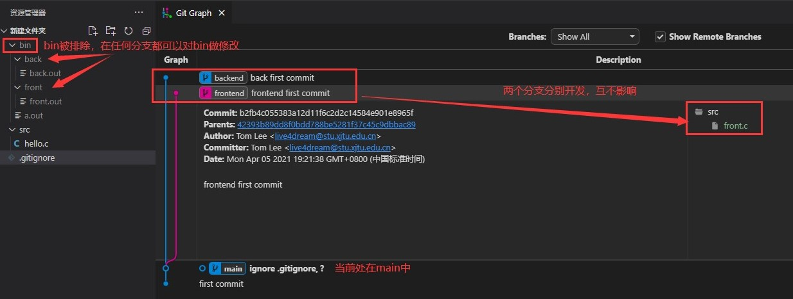
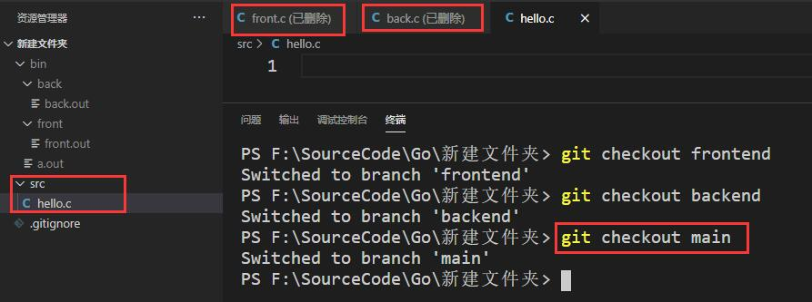
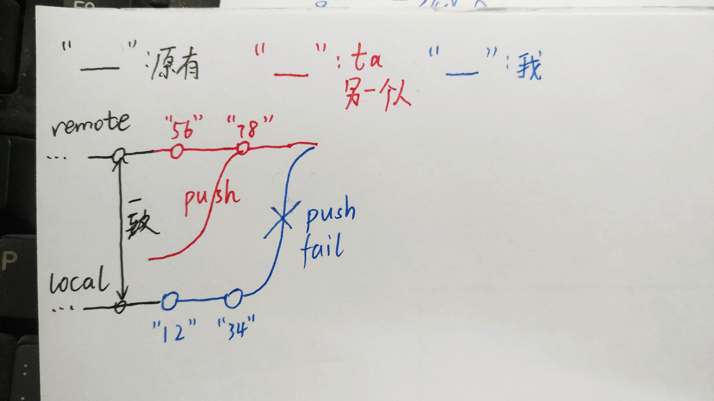
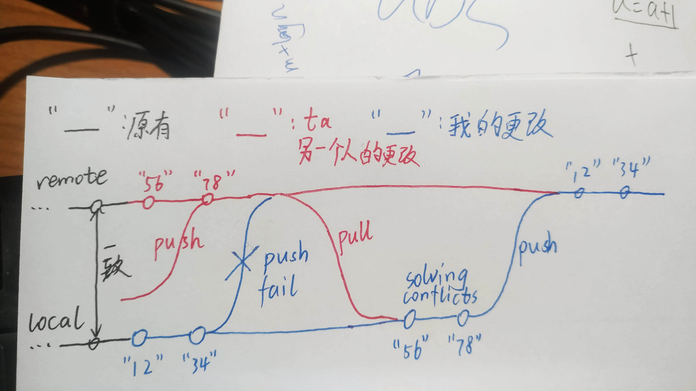
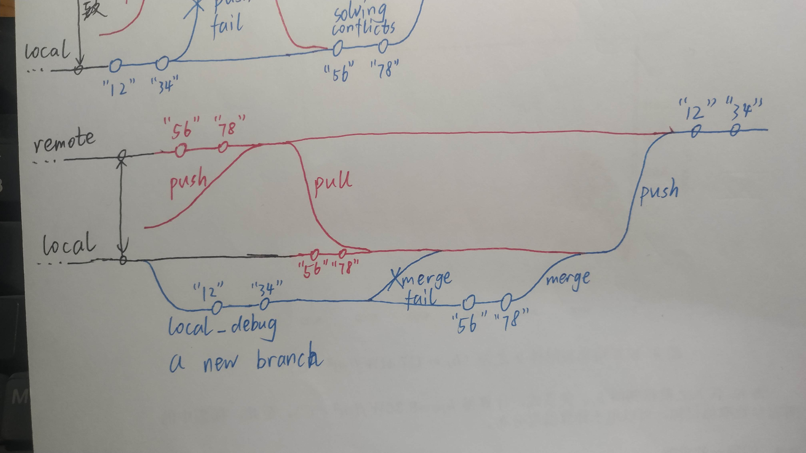

# git分支和文件夹

本文档约定如何妥善使用git分支，以及各分支下的文件夹。其内容可能根据开发过程不断改变。  
本文档仍在征求意见中。  

## git分支

### 设计思想

纯属我瞎想的，网上有更好的就用更好的。  

在之前几次网络实验中，我们已经使用Git来进行简单的版本控制：几次实验成果塞在一个Git仓库里。除了word等二进制文件的折磨，这种设计也增加了一些不必要的pull和merge操作。有没有一种更合理的使用方式呢？  

也许将程序的各部分，分散在不同的分支里更好：  

1. 这些分支之间互不merge；  

2. 每个分支包含几个较为独立的模块和对应的文档；  

3. 这些分支之间通过.gitignore中排除的文件夹来联调联试。  

假设程序大体分为前端模块、后端模块和数据库模块，其中由于嵌入式SQL的影响，数据库和后端密不可分，可以将数据库归到后端中。于是，我们建立3个分支：  

1. main，放置全局文档、前后端接口文档等；  

2. frontend，放置前端代码、客户端网络模块代码，及其文档；  

3. backend，放置后端代码、服务器网络模块代码、数据库代码，及其文档。  

  
假设某天清晨，两个人都进行了开发：一个写了点前端代码，另一个写了点后端代码。由于他们在不同的分支开发，所以他们中午吃饭前push的时候并不会遇到冲突，也就不会因为解决冲突而抢不到饭吃。  

但这样也会出现一个问题：假如前后端的交互出了点问题，需要同时运行前后端程序、查看前后端代码。因为只能位于一个分支里，所以另一个分支的资源该怎么访问呢？  
答：使用在.gitignore中统一屏蔽掉的文件夹，如/bin/。先后编译两个分支的代码，把程序放到这个文件夹中，然后前后端程序同时运行。至于同时看两个分支的代码。。。可以提前在文本编辑器里打开一个分支的相关代码文件，然后转换到另一分支，这样虽然前面的文件会显示“已删除”，但还是能看的。。。  

### 具体问题

1. 前端和后端的网络模块，相似中带着不同，如果它们位于不同分支，是要把很多代码来回复制吗？这岂不是破坏了版本控制的思想？  
呃。。。好问题，我也不太清楚怎么解决。  

2. 还有很多需要学习，所以建了一个learn分支，可以把试写的代码啥的放上去。

3. 等待添加。。。

### 远程仓库

假如某天早上，我在frontend分支写了点代码，不巧别人也在frontend写了点代码，ta先push，成功；我稍后提交，此时我必然要处理冲突：  

我想到两种处理方法，你觉得哪种更好？  

1. 直接在本地的frontend解决冲突，然后push。  

2. 写代码前，在本地先pull frontend一下，然后依据最新的frontend建立一个frontend_debug分支；写完以后再pull frontend一下，然后处理本地frontend_debug和本地frontend之间的冲突；解决完以后push frontend，成功后删除本地frontend_debug。  

## 文件夹

每个分支都可能有代码、对应的文档、和其它二进制文件（如图片等）。建议将代码放在/src/中，文档放在/doc/中，程序需要调用的资源（如.ui文件等）放在/resource/中，文档中的图片等放在/doc/pic/中。现实中视具体开发情况而定。
