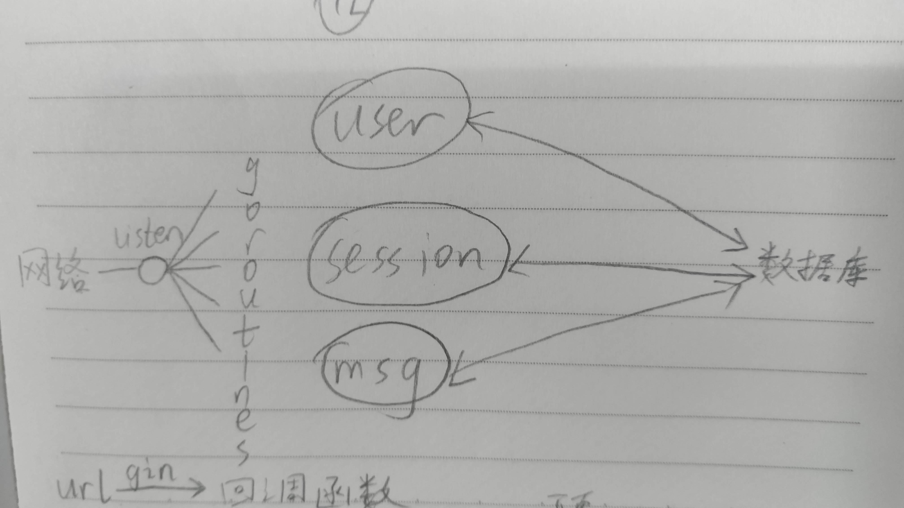
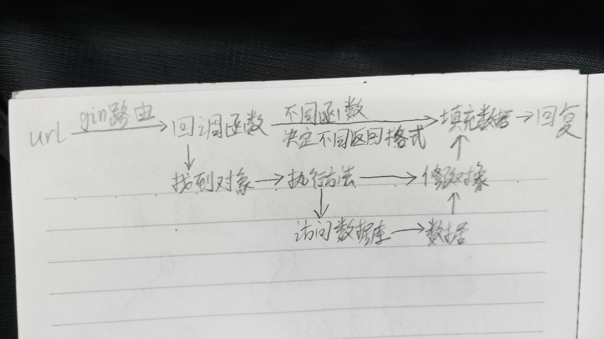

# 顶层软件开发文档

本文档用于描述软件开发的顶层设计，包括需求分析和功能设计、技术栈选择、功能模块划分、职责划分、开发流程。  
更详细的全局文档，参见[本doc目录](./)下的其他文件；各模块的文档，参见各分支的doc目录；项目简述，参见[README.md](../README.md)。  

## 需求分析和功能设计

实现一个简单的聊天程序  

1. 功能类似于QQ的简单聊天程序，不一定需要图形界面；具体的通信模式不限，可以是单纯的客户机/服务器（C/S）模式，也可以是混合C/S和P2P模式；具体协议不限，可以是基于TCP的实现，也可以是混合TCP和UDP协议的实现。  

C/S之间的协议采用HTTP与WebSocket混合；P2P采用UDP或WebRTC。  

2. 基本功能包括：A. 验证用户登录；B. 两个用户的文字聊天；C. 用户之间传输文件，包括二进制的大文件（比如 100MB）。  

A. 使用HTTP完成  
B. 使用WebSocket完成  
C. 使用WebSocket完成  

3. 高级功能包括：A. 支持 NAT 穿透；B. 离线文件和断点续传的支持；C. 语音聊天。  

A. 在S的辅助下，C1与C2交换彼此信息，然后使用UDP进行打洞  
B. 离线文件通过数据库+文件系统方式做到，断点续传暂无  
C. 语音聊天暂无计划，除非使用WebRTC  

## 技术栈选择

后端使用Golang, gin, Mysql等。  

## 功能模块划分

  
  

## 职责划分

mhq前端，我后端。网络协议交流后共同决定。  

## 开发流程

敏捷与传统并重。  
